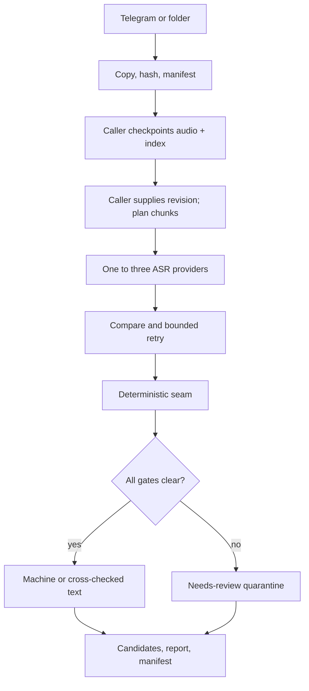
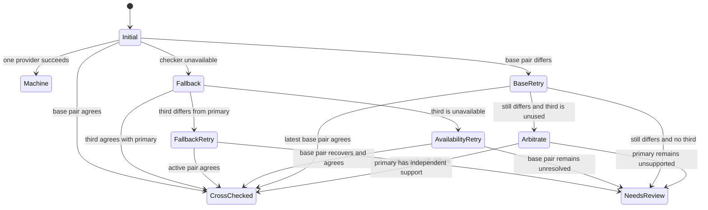

# OctoScribe Architecture

This document describes the implemented fidelity-first pipeline. It is written
for maintainers who need to understand where words can enter, how disagreement
is handled, and which evidence must exist before text is published.

## Design invariants

The implementation is organized around these non-negotiable rules:

1. Source audio has a SHA-256 identity and is checked before transcription.
2. Every enabled provider receives the same materialized chunk bytes.
3. Provider output is evidence; it is never sent through a prose cleanup or
   proofreading model.
4. The configured primary provider owns the canonical word surface. A second
   or third provider can validate or dispute it, but cannot silently rewrite it.
5. Chunk stitching is deterministic and may remove only a proven duplicate at
   the continuation prefix.
6. Discrepancy resolution is bounded to at most one two-provider retry and one
   third-provider arbitration pass.
7. Unresolved provider or seam differences become `needs_review`.
8. Only explicit human comparison against the audio can produce
   `human_verified`.
9. OctoScribe performs no Git operations. In the recommended production
   workflow, the caller commits audio and its manifest checkpoint before
   invoking transcription with the captured revision and branch.

These controls reduce and expose transcription risk. They do not make a
machine-only guarantee that every spoken word was recognized correctly.

## End-to-end flow



The primary components are:

| Component | Responsibility |
| --- | --- |
| `src/folder.py`, `src/telegram.py` | Acquire audio through interchangeable source adapters. |
| `src/manifest.py` | Track source identity, transcript provenance, quality state, and failures. |
| `src/transcribe/audio_chunks.py` | Probe audio, detect silence, and materialize deterministic WAV chunks. |
| `src/transcribe/chunking.py` | Pure chunk-boundary policy and conservative text seam alignment. |
| `src/transcribe/backends/` | Provider-specific transport and transcript extraction. |
| `src/transcribe/consensus.py` | Comparison-only token alignment and discrepancy classification. |
| `src/transcribe/ensemble.py` | One-to-three-provider orchestration with a hard stop. |
| `src/transcribe/evidence.py` | Append-only candidates and aggregate evidence reports. |
| `src/transcribe/transcriber.py` | Batch processing, transcript publication, and manifest updates. |

## Configuration

`Config.load()` resolves values in this order:

```text
CLI override > process environment or .env > INI > built-in default
```

Credentials are read from environment variables. INI files hold non-secret
policy such as source mode, model names, chunk dimensions, and local workspace
paths. Repository URLs, branches, and Git credentials are caller concerns and
are not part of the transcription engine. Validation is command-aware: folder
acquisition does not require Telegram credentials, while Telegram `run`,
`download`, and `debug` do.

### Provider discovery

If `[transcribe] providers` and `OCTOSCRIBE_ASR_PROVIDERS` are both absent, the
loader discovers configured providers in this order:

1. `openai` when `OPENAI_API_KEY` exists;
2. `xai` when `XAI_API_KEY` exists;
3. `meta` when `META_ASR_URL` exists.

This makes OpenAI the default primary when its key is present. Explicit
configuration accepts one to three unique providers:

```ini
[transcribe]
providers = openai,xai,meta
primary_provider = openai
model = gpt-transcribe
language = en
```

Aliases are canonicalized at configuration time: `grok` becomes `xai`,
`omnilingual`/`meta_asr` becomes `meta`, and `local`/`local_whisper` becomes
`whisper`. Provenance always records canonical names.

The historical `[transcribe] backend = openai|local` setting is retained for a
single backend. An explicit backend and explicit provider list are mutually
exclusive so there is only one active selection policy.

## Source adapters

### Telegram

`TelegramDownloader` scans the configured group, recognizes supported audio,
creates collision-safe filenames, downloads into the audio repository, hashes
the completed file, and records metadata in the text repository's manifest.
Its Telethon session lives outside both evidence repositories by default.

### Folder

`FolderImporter` scans the configured directory recursively or non-recursively,
copies recognized audio into the same audio directory used by Telegram, hashes
the source and copied file, and rejects a mismatched copy. Its manifest key is
content-derived, so identical bytes are deduplicated independently of filename
or directory. It also reads safe textual embedded tags and technical container
properties through mutagen (including title/artist, album, date, duration,
codec, bitrate, sample rate, and channels) without treating metadata failure as
an acquisition failure. Binary tags such as cover art are not copied into JSON.

After acquisition, both sources are indistinguishable to the transcription
pipeline: each manifest entry points to an audio filename and SHA-256 digest.
On success, the transcription object adds repository-relative `audio_path` and
`output_path` values while retaining the legacy `output_file`, so the manifest
is the direct audio-to-text index for shared and split layouts.

## Audio integrity and caller-owned publication

The recommended configuration uses two caller-prepared worktrees:

- the audio repository contains `audio/`;
- the text repository contains `manifest.json`, `transcriptions/`,
  `candidates/`, and `reports/`.

Shared worktrees remain supported when only `[data_repo]` or `DATA_REPO_PATH`
is configured. These names describe directory layout, not a remote-management
feature.

The composite action does not inspect Git state and never clones, pulls,
commits, or pushes. The full reference workflow owns this production order:

1. use `octoleo/git-user@v2` and clone the desired worktrees and branches;
2. invoke `download` to acquire audio and save the persistent manifest;
3. commit and push exact audio bytes; in shared layout checkpoint audio and
   manifest together;
4. in split layout, separately commit and push the manifest checkpoint so an
   ephemeral-runner failure cannot lose downloaded state;
5. capture the audio commit revision and current branch;
6. invoke `transcribe` with `audio_revision` and
   `audio_repository_branch`;
7. commit and push the manifest, candidates, reports, and published text.

The workflow uses `continue-on-error` only to reach checkpoint steps. It then
propagates the original action failure after saving available audio, index, or
provider evidence. This does not convert a failed transcription into success.

Immediately before provider work, `Transcriber` hashes audio again and compares
it with the manifest. A changed source fails closed. When the caller supplies a
revision, aggregate evidence records it as provenance; OctoScribe does not try
to discover or validate that revision through Git.

## Deterministic long-audio processing

`FFmpegAudioTools` probes the duration and uses `silencedetect` to identify
possible boundaries. `plan_chunks()` owns the pure, deterministic policy:

- target core duration: 480 seconds;
- hard context-window maximum: 600 seconds;
- total adjacent context overlap: 12 seconds;
- silence search window: 45 seconds by configured default;
- core windows form a gapless, non-overlapping partition;
- adjacent context windows share exactly the configured overlap.

For an interior boundary, half the overlap is added on each side. A nearby
silence is preferred; ties choose the earlier point. If no eligible silence is
available, the exact target boundary is used. Recordings already below the hard
maximum use one chunk and therefore need no seam.

A 90-minute recording is therefore processed as a finite sequence of bounded
chunks rather than one oversized request. Its duration does not change the
semantic retry limits; each chunk still follows the same one-, two-, or
three-provider state machine.

Each context window is materialized once as mono 16 kHz, 16-bit PCM WAV. A
chunk must be non-empty and no larger than the configured 24 MiB policy limit.
The chunk is SHA-256 hashed, and that one file is passed to every provider.
Temporary partial files are removed on failure.

## Provider adapters

`create_backend_registry()` constructs only enabled providers, in configured
order, using lazy imports.

### OpenAI

`OpenAIBackend` uses the Audio Transcriptions API with `gpt-transcribe` by
default. It supplies the configured language preference (English by default)
and the shared verbatim instruction. It accepts transcript text only and
rejects empty or malformed responses. A provider request is independently
protected by transient-error retry policy and a request timeout.

### xAI/Grok

`XAIBackend` calls the pinned TLS endpoint `https://api.x.ai/v1/stt`. The
multipart request retains filler words and disables inverse text normalization.
The adapter returns xAI's text unchanged and parses available word timing,
confidence, language, and duration into its in-process provider result. The
persisted candidate keeps the raw text and hash plus any available word timing,
confidence, language, and duration evidence. The pinned host prevents a
configuration mistake from redirecting the xAI key and sermon audio elsewhere.

### Meta Omnilingual ASR

`MetaASRBackend` is an adapter for an explicitly hosted, OpenAI-compatible audio
transcription service. It does not launch a model and does not assume that a
local Llama or Ollama server can accept audio. It sends `model`, `language`, and
the chunk to a resolved `/v1/audio/transcriptions` endpoint.

Remote endpoints require HTTPS; loopback may use HTTP. The default official
model/language identifiers are `omniASR_LLM_Unlimited_7B_v2` and `eng_Latn`.
Embedded URL
credentials, query strings, and fragments are rejected. An optional bearer
token comes from `META_ASR_API_KEY`.

### Local Faster-Whisper

`LocalWhisperBackend` remains an opt-in compatibility provider named
`whisper`. Its large model runtime is isolated in `requirements-local.txt` and
is not installed with the core runtime. It is useful offline but is not part of
the recommended OpenAI/xAI fidelity path.

## Bounded comparison state machine

The ensemble processes each chunk independently. The primary and the next
configured provider are the base pair; a third provider is reserved as the
arbiter.



Important details:

- Failure to obtain the initial primary candidate is fatal for that recording;
  successful peer output is still persisted when available. A later primary
  retry may fail without discarding its earlier successful candidate.
- If the secondary fails and a third provider is available, the third becomes
  the active checker immediately. It validates only by agreeing with the
  primary; otherwise that active pair receives the one discrepancy retry.
- If that fallback call also fails, the third provider is considered consumed;
  the original base pair receives one availability retry and the third is not
  called again as an arbiter.
- The discrepancy retry calls both base providers once. If one retry fails, the
  comparison may use the successful latest attempt and the other provider's
  previous successful attempt; attempt numbers and stages are recorded.
- In normal three-provider operation, the third provider runs once after the
  base-pair retry. A two-of-three result passes only when the agreeing pair
  includes the primary. Agreement between the two non-primary providers never
  rewrites or certifies unsupported primary text.
- Transport retries inside a backend are also bounded by `retry_attempts`; they
  are separate from the single semantic discrepancy retry. The default is one
  transient transport retry per semantic listen, and OpenAI SDK retries are
  disabled so the budget is not multiplied invisibly.

`compare_transcripts()` builds comparison-only word views. Unicode is
normalized, case-folded, and stripped of punctuation for alignment, but each
original transcript remains available. Differences are classified as
additions, deletions, or substitutions. Disagreements touching negations,
numbers, or recognized Scripture references are marked critical for review.

## Conservative stitching

Chunk text is assembled deterministically from overlapping canonical-primary
ASR text. It is never sent to a generative editor for rewriting, so stitching
adds no provider call, no extra model cost, and no hidden opportunity to change
wording. For each adjacent pair, `stitch_with_alignment()` compares at most 96
tokens from the left suffix and right prefix. Production defaults require:

- at least six exact normalized token matches;
- similarity `1.0`, so any insertion, deletion, or substitution rejects the
  seam.

On acceptance, only the proven duplicated prefix of the continuation is
omitted. The left surface is retained byte-for-byte. On rejection, both
surfaces are joined without deletion and the recording becomes `needs_review`.
This can leave duplicated words in a review copy, which is safer than silently
deleting possibly spoken words.

After stitching, publication normalization is whitespace-only: line endings,
trailing spaces, and excessive blank lines are made deterministic. Spoken words
are not corrected or reformatted.

## Evidence model

Every run has a unique run ID. `EvidenceStore` writes deterministic JSON with
schema version `1.2`.

### Candidate evidence

One append-only candidate file is written per audio, chunk, provider, model,
and attempt. It contains:

- source audio path, SHA-256, and duration;
- chunk index, boundaries, path, and SHA-256;
- provider, model, attempt number, raw transcript, transcript SHA-256, and any
  provider-supplied word timings/language/duration;
- run ID and schema version.

Candidates are written as soon as a paid provider result is available, before
later chunks finish. Reusing the same candidate identity with different bytes
raises an evidence conflict instead of overwriting history.

### Aggregate report

The per-recording report contains all chunk attempts, the canonical provider
and attempt, stage-specific pair comparisons, exact disagreement token spans,
critical categories, bounded provider failures, seam decisions, final quality
state, final transcript SHA-256, and the caller-supplied audio repository
branch/revision when available.
Existing evidence cannot be silently removed or replaced by an update.

The manifest links the published text to its report, records providers,
primary provider, audio and transcript hashes, duration, discrepancy count,
provider failures, quality state, and source revision when available. Error
strings are whitespace-normalized, bounded, and scrubbed of configured API
keys before persistence.

Before selecting work, `Transcriber` reconciles terminal manifest entries with
the filesystem. An entry is skipped only when `output_file` is a safe relative
path to a regular file inside the configured transcription directory and the
file still matches `transcript_sha256` when that digest is present. Missing,
escaped, symlinked, or hash-mismatched outputs are re-queued. This makes the
manifest an idempotence checkpoint without allowing stale state to conceal lost
or modified text.

## Quality states and output locations

| State | Meaning | Default output location |
| --- | --- | --- |
| `machine_transcribed` | One configured provider produced non-empty text; no independent agreement exists. | `transcriptions/` |
| `cross_checked` | At least two configured providers agreed on normalized words for every chunk and every required seam was proven. | `transcriptions/` |
| `needs_review` | An unresolved disagreement, lack of independent verification, or unproven overlap seam remains. | `transcriptions/needs-review/` |
| `human_verified` | A human explicitly compared the transcript with the source audio. | Recorded in manifest after review |

`needs_review` is terminal for automation so the same paid work is not repeated
forever. It is a quarantine state, not a correctness claim.

## Failure containment

- Empty source, chunk, or provider text fails instead of becoming a completed
  transcript.
- Chunk size, duration, workers, provider count, retry limits, and timeouts are
  validated before work begins.
- ffmpeg/ffprobe and HTTP calls have finite timeouts.
- Provider exception messages are redacted before they enter the manifest.
- Transcript names are collision-safe, and writes use atomic replacement.
- Raw candidates and reports are append-only by evidence identity.
- The automatic semantic loop is structurally finite: an initial pair followed
  either by one base-pair retry and one unused-third arbiter call, or by one
  fallback call and at most one active-pair/availability retry.

## Extension points

To add an ASR provider:

1. implement `TranscriptionBackend` in `src/transcribe/backends/`;
2. return raw text, or a `ProviderTranscript` from `transcribe_detailed()` when
   structured timing evidence is available;
3. add the canonical name and lazy factory to `backends/registry.py`;
4. add configuration validation without putting secrets in the INI;
5. add adapter contract, error, retry, secret-redaction, and ensemble tests;
6. update both configuration templates and this document.

Do not add a generic language-model correction stage. If a future component
suggests edits, it must preserve the raw primary output, identify every proposed
change, require an explicit review policy, and never promote itself to
`human_verified`.

## Related documentation

- [README](../README.md)
- [Testing guide](TESTING.md)
- [INI template](../conf/octoscribe.ini.example)
- [Environment template](../conf/.env.example)
